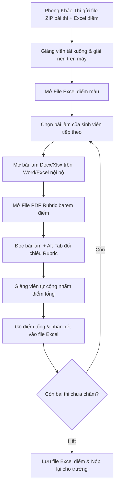
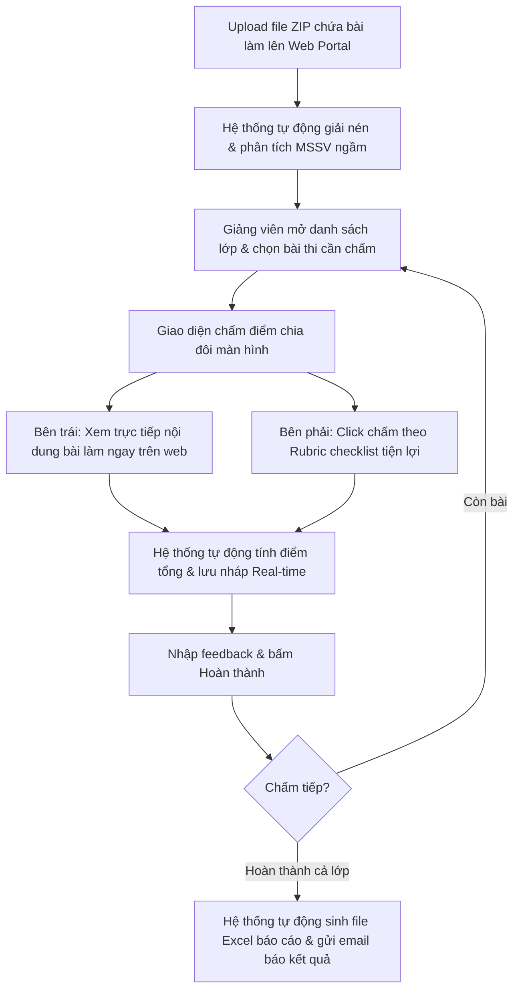
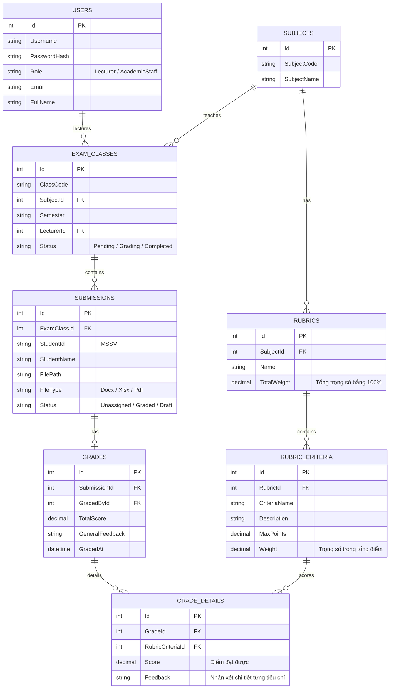

# Phân Tích Nghiệp Vụ (Business Analysis)
## Đề tài: FPTU Grading System for Paper-Based PE (Writing Exams)

Tài liệu này phân tích chi tiết về bối cảnh, quy trình nghiệp vụ hiện tại (As-Is), quy trình đề xuất (To-Be), và phương án ánh xạ kỹ thuật các yêu cầu nghiệp vụ đó vào các thành phần bắt buộc của đồ án môn **PRN232** (REST API, Background Job, Message Broker, gRPC).

---

## 1. Giới thiệu & Bối cảnh (Introduction & Context)
Tại Đại học FPT (FPTU), các kỳ thi **Practical Exam (PE)** là bắt buộc đối với hầu hết các môn chuyên ngành. 
* Đối với các môn lập trình, sinh viên thi trực tiếp trên hệ thống chấm tự động (EOS, PEA).
* Đối với các môn yêu cầu viết luận (Writing), thuyết trình, làm báo cáo hoặc xử lý dữ liệu văn phòng (như các môn học về Business Communication, English Academic, Social Sciences, Excel/Word nâng cao, v.v.), sinh viên làm bài bằng cách gõ trên máy tính, lưu dưới dạng file tài liệu (Docx, XLSX, PDF) rồi nộp lên hệ thống thi.

Tuy nhiên, việc **chấm điểm** các bài thi dạng tự luận/văn bản này hiện nay của giảng viên vẫn được thực hiện một cách rất thủ công và rời rạc, làm giảm đáng kể hiệu suất và tính chính xác.

---

## 2. Quy trình nghiệp vụ hiện tại (As-Is Process) & Các điểm nghẽn (Pain Points)

### 2.1 Quy trình hiện tại (As-Is)
Quy trình chấm bài thi tự luận/văn bản đang diễn ra như sau:
1. **Phòng Khảo thí** thu thập bài thi của sinh viên từ hệ thống nộp bài thi tập trung, nén toàn bộ bài làm của một lớp thành một file `.zip`. Gửi file `.zip` này kèm theo một file mẫu điểm Excel (Grade template) và barem điểm (Rubrics) cho giảng viên qua email hoặc qua cổng thông tin nội bộ.
2. **Giảng viên** thực hiện các bước:
   * **Tải xuống và giải nén**: Tải file `.zip` bài thi về máy tính cá nhân và giải nén thành một thư mục chứa hàng chục đến hàng trăm file bài làm (đặt tên dạng `MSSV_HoTen_MonThi`).
   * **Mở file điểm**: Mở file Excel mẫu điểm của lớp đó lên.
   * **Chấm điểm từng sinh viên**:
     1. Mở file bài làm của sinh viên đó (bằng Microsoft Word hoặc Excel trên máy).
     2. Mở file PDF/Word chứa barem điểm (Rubric) ở một cửa sổ khác.
     3. **Alt-Tab liên tục** giữa: *Cửa sổ bài làm* (để đọc nội dung) $\leftrightarrow$ *Cửa sổ Rubric* (để xem tiêu chí chấm và mức điểm tương ứng) $\leftrightarrow$ *Cửa sổ Excel điểm* (để nhập điểm).
     4. Tự cộng nhẩm điểm của từng tiêu chí để ra điểm tổng cuối cùng cho sinh viên.
     5. Gõ điểm tổng và nhận xét (nếu có) vào dòng tương ứng với sinh viên đó trên file Excel điểm.
   * **Nộp điểm**: Sau khi chấm xong cả lớp, giảng viên lưu file Excel điểm lại, nén thư mục (nếu có yêu cầu lưu trữ bài chấm) và upload hoặc gửi lại qua mail cho phòng Khảo thí.

### 2.2 Các điểm nghẽn chính (Pain Points)
> [!WARNING]
> Những bất tiện này không chỉ làm giảm năng suất làm việc của giảng viên mà còn tăng rủi ro sai sót trong kết quả học tập của sinh viên.

* **"Cực hình" Alt-Tab (Window Switching)**: Giảng viên phải chuyển đổi liên tục giữa 3-4 cửa sổ ứng dụng (Word, Excel, PDF Reader, Web browser). Điều này gây mỏi mắt, phân tâm và mất nhiều thời gian vô ích.
* **Nhầm lẫn bài làm và cột điểm**: Do mở nhiều file cùng lúc trên máy tính, giảng viên rất dễ đọc bài của sinh viên A nhưng lại gõ nhầm điểm vào dòng của sinh viên B trên file Excel điểm.
* **Sai lệch số học (Arithmetic Errors)**: Việc tự tính điểm tổng từ các tiêu chí nhỏ một cách thủ công bằng cách cộng nhẩm hoặc dùng máy tính cầm tay rất dễ xảy ra sai sót, đặc biệt khi chấm bài muộn hoặc mệt mỏi.
* **Khó theo dõi tiến độ chấm**: Không có dashboard trực quan hiển thị tiến độ (ví dụ: đã chấm bao nhiêu bài, còn bao nhiêu bài, bài nào đang chấm dở). Giảng viên phải tự nhớ hoặc tìm xem file nào trong thư mục chưa được mở.
* **Quản lý tệp cục bộ bất tiện**: Nếu giảng viên muốn thay đổi thiết bị chấm (ví dụ: từ máy ở trường sang máy cá nhân ở nhà), họ phải sao chép toàn bộ thư mục bài làm và file Excel điểm, dẫn đến nguy cơ lệch phiên bản dữ liệu.

---

## 3. Quy trình đề xuất (To-Be Process) & Giải pháp của Tool
Ứng dụng **FPTU Grading System for Paper-Based PE** sẽ số hóa và tích hợp toàn bộ quy trình trên lên một nền tảng Web tập trung, tối giản hóa tối đa các thao tác thủ công của giảng viên.

### 3.1 Quy trình đề xuất (To-Be)
1. **Upload tài nguyên**: Giảng viên hoặc Giáo vụ chỉ cần tải file `.zip` chứa toàn bộ bài thi của lớp lên hệ thống, đồng thời tải lên file Excel điểm mẫu và chọn cấu hình Rubric tương ứng.
2. **Xử lý ngầm tự động**: Hệ thống tự động giải nén, bóc tách các file bài làm của sinh viên dựa trên cấu trúc tên file (MSSV), và chuẩn bị sẵn một danh sách chấm điểm trực quan trên web.
3. **Chấm bài tích hợp (Single-screen Interactive Interface)**:
   * Giảng viên chọn một lớp thi và bắt đầu chấm bài.
   * Giao diện web được chia làm hai phần (Split-screen):
     * **Bên trái (Document Viewer)**: Hiển thị trực tiếp nội dung bài làm của sinh viên (Word, Excel, PDF) ngay trên trình duyệt mà không cần tải về máy hay mở ứng dụng ngoài.
     * **Bên phải (Interactive Rubric)**: Hiển thị bảng tiêu chí chấm điểm chi tiết dưới dạng các checklist/radio button. Giảng viên chỉ cần click chọn mức điểm cho từng tiêu chí (ví dụ: Trình bày: 1đ, Nội dung: 4đ, Ngữ pháp: 2đ).
   * **Tự động hóa**: Hệ thống tự động tính điểm tổng theo trọng số cấu hình sẵn và tự động lưu nháp (Auto-save) sau mỗi thao tác. Giảng viên có thể ghi nhận xét trực tiếp cho từng tiêu chí hoặc nhận xét chung.
4. **Kết xuất dữ liệu**: Sau khi hoàn thành, giảng viên chỉ cần bấm "Publish". Hệ thống sẽ tự động xuất file Excel điểm theo đúng mẫu ban đầu của trường và gửi email thông báo kết quả.

---

## 4. Ánh xạ nghiệp vụ vào Kiến trúc Đồ án PRN232
Để đáp ứng các yêu cầu kỹ thuật bắt buộc của đề bài môn **PRN232**, hệ thống sẽ được xây dựng theo kiến trúc phân tán (Distributed Architecture) bao gồm các thành phần sau:

### 4.1 REST API Service (ASP.NET Core 8+)
Đây là dịch vụ trung tâm, quản lý cơ sở dữ liệu chính và cung cấp API cho Frontend:
* **Authentication**: Đăng nhập giảng viên/giáo vụ bằng **JWT Token** (hỗ trợ phân quyền `Lecturer` và `Academic Staff`).
* **Manage Rubrics**: CRUD các tiêu chí chấm điểm của từng môn học (bao gồm tiêu chí cha, tiêu chí con, mức điểm tối đa, trọng số điểm).
* **Manage Class & Submissions**: Lưu thông tin học kỳ, lớp học, danh sách sinh viên và file bài làm.
* **Grading Engine**: API ghi nhận điểm thành phần, tính tổng điểm và lưu feedback của giảng viên.
* **Search & Filter**: Hỗ trợ tìm kiếm bài làm theo MSSV, tên sinh viên, lọc theo trạng thái (Chưa chấm, Đang chấm, Đã hoàn thành), phân trang danh sách lớp.

### 4.2 Background Job Service (Worker / Hangfire)
Đảm nhận các tác vụ xử lý bất đồng bộ nặng để đảm bảo trải nghiệm Frontend luôn mượt mà và không bị nghẽn (Blocking):
* **Zip Extraction & Mapping**: Giải nén file `.zip` bài làm của lớp thi. Quét qua các file được giải nén, dùng Regex để tìm mã số sinh viên (MSSV) trên tên file, liên kết file đó với sinh viên tương ứng trong database, sau đó lưu file vào hệ thống lưu trữ (Storage).
* **Report Generator**: Khi giảng viên bấm xuất điểm, Background Job sẽ khởi chạy để ghi dữ liệu điểm vào file Excel mẫu và lưu trữ file Excel báo cáo hoàn chỉnh này.
* **Notification Sender**: Gửi email thông báo cho giảng viên khi tiến trình giải nén file ZIP hoàn tất, hoặc gửi email báo cáo điểm tổng hợp cho Giáo vụ khoa.

### 4.3 Message Broker (Redis Streams / Redis PubSub)
Đóng vai trò là cầu nối liên lạc bất đồng bộ (Asynchronous Messaging) giữa các service độc lập:
* **Kịch bản gửi file ZIP**:
  1. Giảng viên upload file ZIP bài thi lên Web API $\rightarrow$ Web API lưu file ZIP vào ổ đĩa/cloud storage và publish một message chứa `FileZipPath` và `ClassId` vào Redis Stream `zip-upload-channel`.
  2. Background Job Service (đang lắng nghe Redis Stream) nhận được thông điệp, lập tức xử lý giải nén ngầm.
  3. Sau khi giải nén và ánh xạ xong, Background Job gửi một message phản hồi `zip-processed-event` về Redis Stream. Web API nhận được và đẩy thông báo real-time tới giảng viên qua SignalR (Websocket) thông báo "Xử lý file bài thi thành công, bạn đã có thể bắt đầu chấm".
* **Kịch bản xuất báo cáo**:
  1. Giảng viên bấm "Xuất file báo cáo điểm" $\rightarrow$ Web API gửi yêu cầu vào queue `report-generation-channel`.
  2. Background Job thực hiện sinh file Excel và gửi tin nhắn hoàn thành kèm đường dẫn download.

### 4.4 gRPC Service
Một service độc lập phục vụ nhu cầu giao tiếp hiệu năng cao (High-performance RPC) giữa REST API và các tác vụ tính toán hoặc hỗ trợ khác:
* **Dịch vụ Đề xuất 1: Document Converter Service (Chuyển đổi tài liệu)**
  * **Lý do**: File bài làm của sinh viên thường là `.docx` hoặc `.xlsx`. Trình duyệt web không thể tự hiển thị trực tiếp các file này một cách đẹp mắt.
  * **Giải pháp**: Xây dựng một gRPC Service riêng. Khi giảng viên click vào bài làm của một sinh viên, REST API sẽ gọi gRPC Service truyền file `.docx`/`.xlsx` sang. gRPC Service sẽ chuyển đổi file này thành định dạng HTML hoặc PDF động và trả về luồng dữ liệu hiển thị cực kỳ nhanh chóng.
* **Dịch vụ Đề xuất 2: Plagiarism Detection Service (Kiểm tra trùng lặp - Tính năng nâng cao)**
  * **Lý do**: Các bài thi tự luận dễ xảy ra tình trạng sao chép bài của nhau.
  * **Giải pháp**: gRPC Service sẽ nhận nội dung text của các bài làm trong cùng một lớp, chạy thuật toán so sánh độ tương đồng (Cosine Similarity / Jaccard Similarity) và trả về danh sách các cặp sinh viên có bài làm giống nhau vượt quá ngưỡng cho phép (ví dụ giống nhau > 70%).

---

## 5. Thiết kế Cơ sở dữ liệu logic (Database Schema)

Dưới đây là các thực thể cốt lõi trong hệ thống để quản trị luồng thông tin:

---

## 6. Lợi ích của Giải pháp đối với Giảng viên & Nhà trường

### 6.1 Đối với Giảng viên
* **Tăng 50% tốc độ chấm bài**: Loại bỏ hoàn toàn thao tác Alt-Tab, giải nén và mở file office ngoài. Tất cả diễn ra trên 1 tab trình duyệt duy nhất.
* **Chấm điểm chuẩn xác**: Không lo tính toán sai điểm tổng nhờ động cơ tự động tính theo công thức Rubric.
* **Loại bỏ sai sót nhập nhầm**: Màn hình hiển thị rõ ràng thông tin sinh viên song song với bài làm và bảng chấm điểm, hạn chế tối đa việc chấm nhầm dòng.
* **Tiện lợi lưu nháp**: Chấm bài mọi lúc mọi nơi, tự động lưu tiến độ, không lo mất mát dữ liệu khi đột ngột mất điện hay ngắt mạng.

### 6.2 Đối với Nhà trường (Phòng Khảo thí / Khoa)
* **Dễ dàng quản lý tiến độ**: Trực quan hóa tiến độ chấm thi của toàn bộ giảng viên trong kỳ thi.
* **Đảm bảo tính công bằng & minh bạch**: Barem điểm Rubrics được cấu hình hệ thống hóa, điểm số chi tiết cho từng tiêu chí được lưu vết cụ thể, phục vụ tốt cho việc phúc khảo bài thi sau này.
* **Hỗ trợ phát hiện gian lận (Plagiarism)**: Tự động cảnh báo các bài viết có tỷ lệ giống nhau bất thường nhờ service gRPC phụ trợ.

---

## 7. Tổng hợp các chức năng của sản phẩm (Product Feature Matrix)

| Chức năng chính | Đối tượng sử dụng | Mô tả | Công nghệ áp dụng |
| :--- | :--- | :--- | :--- |
| **Đăng nhập & Xác thực** | Giảng viên, Giáo vụ | Đăng nhập hệ thống bảo mật bằng tài khoản trường cấp. | ASP.NET Core REST API, JWT |
| **Quản lý Rubrics** | Giáo vụ, Giảng viên | Tạo lập cấu trúc điểm thành phần của các môn thi viết/văn bản. | REST API CRUD |
| **Quản lý lớp & Upload ZIP** | Giáo vụ, Giảng viên | Upload file ZIP danh sách bài làm sinh viên và file Excel điểm mẫu. | REST API, Redis Message Broker |
| **Giải nén & Ánh xạ tự động** | Hệ thống (Ngầm) | Giải nén file ZIP, phân tích MSSV và map bài thi với DB. | Worker Background Job, Regex |
| **Xem tài liệu trực quan** | Giảng viên | Hiển thị bài làm Docx/Xlsx/Pdf ngay trên giao diện chấm điểm. | gRPC Document Converter, HTML5 |
| **Chấm điểm Rubrics thông minh**| Giảng viên | Click checklist tiêu chí, hệ thống tự động cộng dồn và lưu nháp. | REST API, Single Page App Frontend |
| **Kiểm tra trùng lặp bài thi** | Giảng viên, Giáo vụ | Quét độ tương đồng giữa các bài viết để phát hiện copy bài. | gRPC Plagiarism Service |
| **Kết xuất file Excel điểm** | Giảng viên, Giáo vụ | Xuất file Excel điểm chuẩn định dạng của trường để báo cáo. | Worker Background Job, EPPlus Library |
