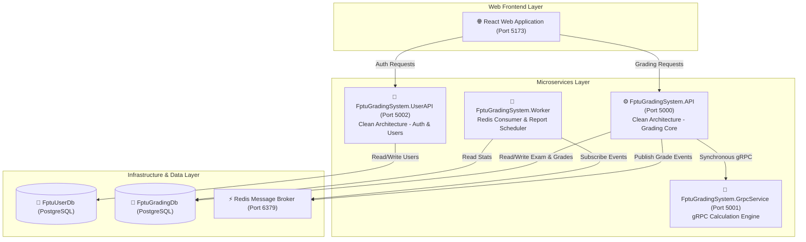

# Implementation Plan - Split User Service & Database-per-Service

Tài liệu này mô tả chi tiết kế hoạch kiến trúc để tách riêng **User/Identity Service** và áp dụng mô hình **Database-per-Service** (tách thành 2 CSDL riêng biệt: `FptuUserDb` và `FptuGradingDb`) theo chuẩn **Clean Architecture** và **Microservices Architecture**.

---

## 🏗️ Kiến trúc Đề xuất (Target Microservices Architecture)



---

## 🛠️ Các Thay Đổi Chi Tiết theo Thành Phần

### 1. [NEW] Dự án `FptuGradingSystem.UserAPI` & Tách CSDL `FptuUserDb`
- **Chức năng:** REST API chuyên trách Xác thực (Auth) & Quản lý Người dùng (User Management).
- **Cấu trúc Clean Architecture:**
  - Controllers: `AuthController.cs` (`POST /api/auth/register`, `POST /api/auth/login`), `UsersController.cs` (`GET /api/users/lecturers`).
  - Database: Kết nối đến **`FptuUserDb`** trên PostgreSQL.
  - Entities: Entity `User` (Id, Username, PasswordHash, FullName, Email, Role).

### 2. [MODIFY] Dự án `FptuGradingSystem.API` & `FptuGradingSystem.Infrastructure`
- **Database-per-Service:** Chuyển `ApplicationDbContext` của hệ thống chấm điểm sang kết nối **`FptuGradingDb`**.
- **Loại bỏ Cross-Database Navigation:**
  - Bỏ navigation property `User` trong Entity `ExamClass` và `Grade` tại `FptuGradingDb` để tránh vi phạm ranh giới CSDL phân tán.
  - Lưu giữ các thuộc tính khóa `LecturerId` và `GradedById` dạng integer ID.
- **Xác thực JWT:** Vẫn sử dụng JWT Bearer Auth middleware với chung chuỗi `JwtSettings:Secret` để xác thực token do `UserAPI` phát hành.

### 3. [MODIFY] Cấu hình `be/docker-compose.yml`
Bổ sung container cho `user-api` và tự động khởi tạo 2 CSDL riêng biệt trên PostgreSQL:
- **`user-api`**: `FptuGradingSystem.UserAPI` trên Port `5002:8080`.
- **`grading-api`**: `FptuGradingSystem.API` trên Port `5000:8080`.
- **`postgres`**: Chạy PostgreSQL tạo 2 databases `FptuUserDb` và `FptuGradingDb`.

### 4. [MODIFY] Frontend `fe/src/`
- Thêm cấu hình baseURL cho User API (`http://localhost:5002/api`) trong `fe/src/api.js`.
- Cập nhật các component `Login.jsx`, `AcademicDashboard.jsx`, `LecturerDashboard.jsx` gọi đúng API endpoint của từng service.

---

## 🔄 Luồng Hoạt Động (Business Workflow)

1. **Đăng nhập / Đăng ký:** Frontend gọi `POST http://localhost:5002/api/auth/login` đến `UserAPI`. `UserAPI` truy vấn `FptuUserDb`, kiểm tra mật khẩu và trả về chuỗi JWT Token chứa `id`, `username`, `role`.
2. **Thao tác Nghiệp vụ Chấm bài:** Frontend gửi request đính kèm JWT Token đến `GRADING_API` (`http://localhost:5000/api/...`). `GRADING_API` giải mã JWT Token để lấy `UserId`, gọi `GrpcService` tính điểm, lưu vào `FptuGradingDb`, và phát Redis Event cho `Worker`.

---

## 🧪 Verification Plan (Kế hoạch Kiểm Thử)

### Automated Build & Container Verification
- Biên dịch thành công toàn bộ Solution .NET:
  ```bash
  dotnet build be/FptuGradingSystem.slnx
  ```
- Khởi chạy toàn bộ 6 Containers Docker Compose:
  ```bash
  cd be
  docker compose up -d --build
  docker compose ps
  ```

### Manual E2E Functional Test
1. Đăng ký & Đăng nhập tài khoản mới tại `http://localhost:5002/swagger` (`UserAPI`).
2. Sử dụng JWT Token truy cập `http://localhost:5000/swagger` (`GradingAPI`) tạo môn học, lớp thi, và nộp điểm.
3. Kiểm tra log container `grading-worker` nhận sự kiện Redis và tính toán báo cáo từ `FptuGradingDb`.
4. Đăng nhập và thực hiện thao tác trên React Frontend (`http://localhost:5173`).
