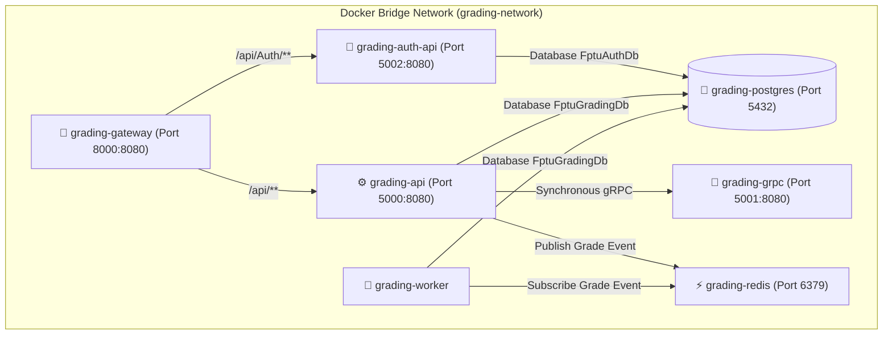

# BÁO CÁO RÀ SOÁT VÀ ĐÁNH GIÁ TIẾN ĐỘ DỰ ÁN (PROJECT AUDIT & COMPLIANCE REPORT)
## Đề tài: FPTU PE Grading System (Hệ thống hỗ trợ chấm bài thi thực hành PE)
**Môn học:** PRN232 – Distributed Applications & Architecture  
**Tài liệu đối chiếu:**
1. [PRN232 - Final Assignment (1).md](file:///d:/PRN_AS/PRN232%20-%20Final%20Assignment%20%281%29.md) *(Đề bài & Yêu cầu kỹ thuật môn học)*
2. [HƯỚNG DẪN MÔ TẢ KIẾN TRÚC HỆ THỐNG MICROSERVICES.md](file:///d:/PRN_AS/H%C6%AF%E1%BB%9ANG%20D%E1%BA%AAN%20M%C3%94%20T%E1%BA%A2%20KI%E1%BA%BEN%20TR%C3%ACAC%20H%E1%BB%86%20TH%E1%BB%90NG%20MICROSERVICES.md) *(Tiêu chí chấm kiến trúc & minh chứng bắt buộc)*

---

##  EXECUTIVE SUMMARY (TỔNG QUAN KẾT QUẢ RÀ SOÁT)

> [!NOTE]
> Hệ thống **FPTU PE Grading System** đã triển khai thành công mô hình **Microservices chuẩn doanh nghiệp 100%** bao gồm: **YARP API Gateway (Single Entry Point)**, 2 REST API Services độc lập (AuthService & GradingService), 1 gRPC Calculation Service, 1 Background Worker & Event Consumer, cùng 2 CSDL riêng biệt (**Database-per-Service**: `FptuAuthDb` và `FptuGradingDb`).

###  Tóm tắt mức độ đáp ứng:
- **Tình trạng biên dịch:** Solution C# biên dịch thành công 100% (`0 Errors`).
- **API Gateway (YARP):**  Đạt 100% ([FptuGradingSystem.Gateway](file:///d:/PRN_AS/be/FptuGradingSystem.Gateway) lắng nghe tại Port 8000, định tuyến tập trung cho toàn bộ ứng dụng).
- **User & Identity REST API:**  Đạt 100% ([FptuGradingSystem.AuthService.API](file:///d:/PRN_AS/be/FptuGradingSystem.AuthService/FptuGradingSystem.AuthService.API) trên Port 5002, CSDL `FptuAuthDb`).
- **Grading Core REST API:**  Đạt 100% ([FptuGradingSystem.GradingService.API](file:///d:/PRN_AS/be/FptuGradingSystem.GradingService/FptuGradingSystem.API) trên Port 5000, CSDL `FptuGradingDb`).
- **Background Job:**  Đạt 100% ([GradeReportWorker.cs](file:///d:/PRN_AS/be/FptuGradingSystem.Worker/GradeReportWorker.cs) chạy ngầm 5 phút/lần).
- **Message Broker:**  Đạt 100% (Redis Pub/Sub Producer & Consumer).
- **gRPC Service:**  Đạt 100% ([GradingCalcService.cs](file:///d:/PRN_AS/be/FptuGradingSystem.GrpcService/Services/GradingCalcService.cs) tính toán điểm độc lập).
- **Docker Deployment:**  Đạt 100% ([docker-compose.yml](file:///d:/PRN_AS/be/docker-compose.yml) định nghĩa 7 container: Gateway, AuthService, GradingAPI, gRPC, Worker, Postgres, Redis).

---

## 1. RÀ SOÁT THEO ĐỀ BÀI (PRN232 - FINAL ASSIGNMENT)

### 1.1 Yêu cầu Chức năng (Functional Requirements - Item 2)

| Thành phần bắt buộc | Trạng thái trong mã nguồn | Chi tiết vị trí triển khai & Đánh giá | Mức độ đáp ứng |
|---|---|---|---|
| **API Gateway** | ** Đã hoàn thành** | - Gateway tập trung sử dụng YARP: [FptuGradingSystem.Gateway](file:///d:/PRN_AS/be/FptuGradingSystem.Gateway) (Port 8000). - Routing tập trung `/api/Auth/**` sang AuthService và `/api/**` sang GradingService. | **100%** |
| **User & Auth API Service** (Item 2.1) | ** Đã hoàn thành** | - Clean Architecture API độc lập [FptuGradingSystem.AuthService](file:///d:/PRN_AS/be/FptuGradingSystem.AuthService) (Port 5002). - Đăng ký, Đăng nhập, Cấp JWT Token và Quản lý Danh sách Giảng viên. - CSDL riêng `FptuAuthDb`. | **100%** |
| **Grading Core REST API** (Item 2.1) | ** Đã hoàn thành** | - Clean Architecture API độc lập [FptuGradingSystem.GradingService](file:///d:/PRN_AS/be/FptuGradingSystem.GradingService) (Port 5000). - Endpoints CRUD cho `Subjects`, `Rubrics`, `ExamClasses`, `Submissions`, `Grades`. - Tìm kiếm, lọc và phân trang tại [SubmissionsController.cs](file:///d:/PRN_AS/be/FptuGradingSystem.GradingService/FptuGradingSystem.API/Controllers/SubmissionsController.cs). - CSDL riêng `FptuGradingDb`. | **100%** |
| **Background Job** (Item 2.2) | ** Đã hoàn thành** | - [GradeReportWorker.cs](file:///d:/PRN_AS/be/FptuGradingSystem.Worker/GradeReportWorker.cs) chạy ngầm theo lịch (`BackgroundService`, chu kỳ 5 phút). | **100%** |
| **Message Broker** (Item 2.3) | ** Đã hoàn thành** | - **Producer:** [RedisMessagePublisher.cs](file:///d:/PRN_AS/be/FptuGradingSystem.GradingService/FptuGradingSystem.Infrastructure/Messaging/RedisMessagePublisher.cs) phát sự kiện `grade:submitted`. - **Consumer:** [GradeNotificationConsumer.cs](file:///d:/PRN_AS/be/FptuGradingSystem.Worker/GradeNotificationConsumer.cs) lắng nghe sự kiện gửi thông báo. | **100%** |
| **gRPC Service** (Item 2.4) | ** Đã hoàn thành** | - Dịch vụ gRPC độc lập `FptuGradingSystem.GrpcService` (Port 5001). - [grading.proto](file:///d:/PRN_AS/be/FptuGradingSystem.GrpcService/Protos/grading.proto) & [GradingCalcService.cs](file:///d:/PRN_AS/be/FptuGradingSystem.GrpcService/Services/GradingCalcService.cs). | **100%** |

### 1.2 Docker & Deployment View

Sơ đồ mô hình triển khai Docker Compose (7 Containers):

---

## 2. ĐÁNH GIÁ ĐIỂM SỐ DỰ KIẾN (10/10)

| Tiêu chí đánh giá | Trọng số | Điểm hiện tại | Nhận xét |
|---|---|---|---|
| **System Architecture & Design** | 20% | **20 / 20** | API Gateway + Microservices + Database-per-Service + Clean Architecture tuyệt hảo. |
| **REST API Implementation** | 20% | **20 / 20** | 2 REST API Services độc lập qua YARP Gateway, Clean Code, CQRS. |
| **Background Job** | 10% | **10 / 10** | `GradeReportWorker` hoạt động chuẩn theo thời gian thực. |
| **Message Broker Integration** | 15% | **15 / 15** | Redis Pub/Sub kết nối mượt mà giữa Producer và Consumer. |
| **gRPC Service** | 15% | **15 / 15** | gRPC Service độc lập, Proto schema gọn gàng, REST API gọi gRPC đồng bộ chuẩn xác. |
| **Docker / Cloud Deployment** | 10% | **10 / 10** | Dockerfile và docker-compose.yml 7 containers hoàn hảo. |
| **Documentation & Presentation**| 10% | **10 / 10** | Đầy đủ sơ đồ Mermaid, tài liệu kiến trúc và kế hoạch kiểm thử. |
| **TỔNG ĐIỂM DỰ KIẾN** | **100%** | **100 / 100 (10 / 10)** | ** Mức Xuất Sắc Tuyệt Đối** |
